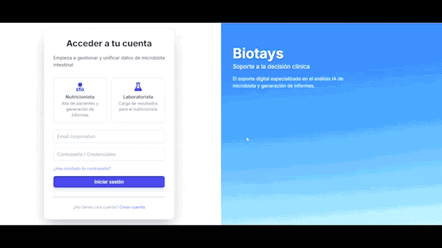
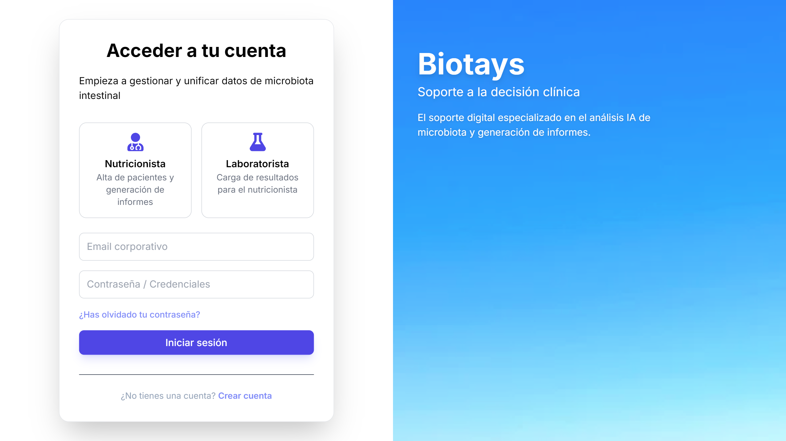
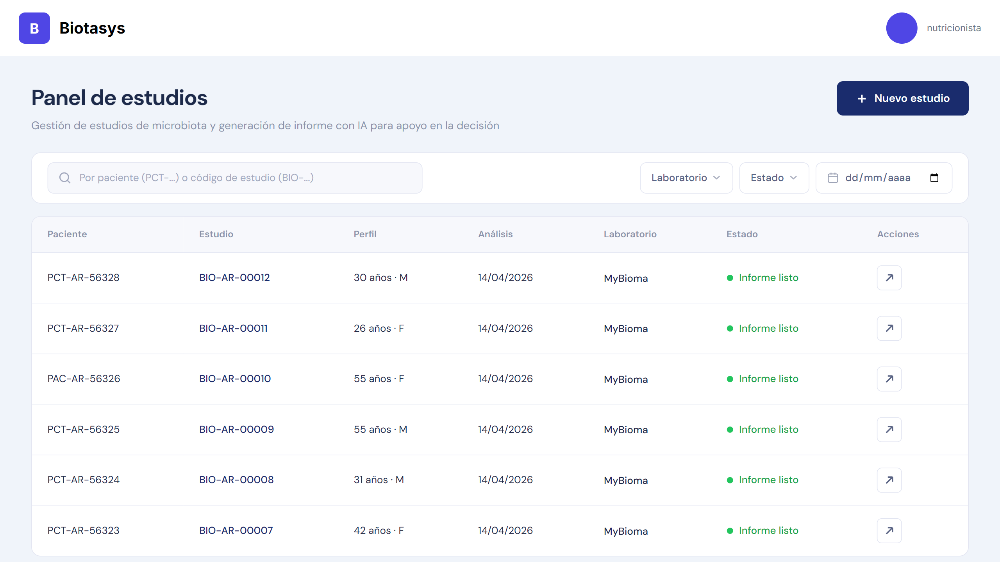
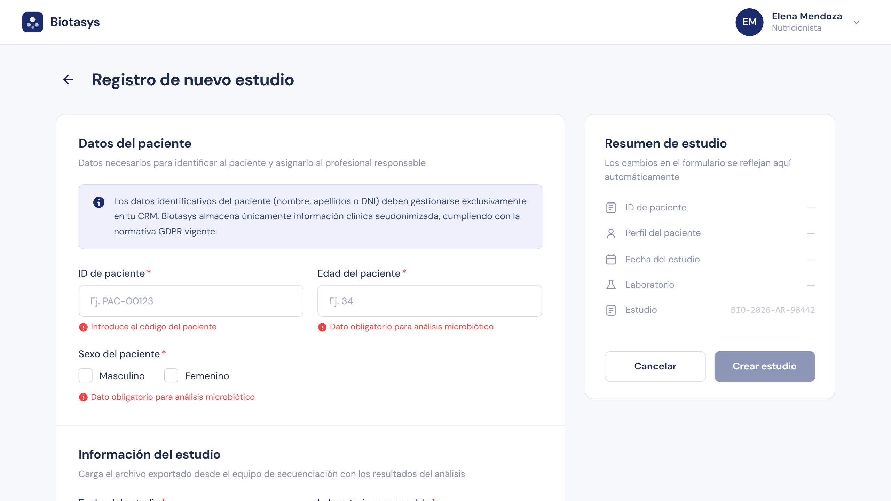
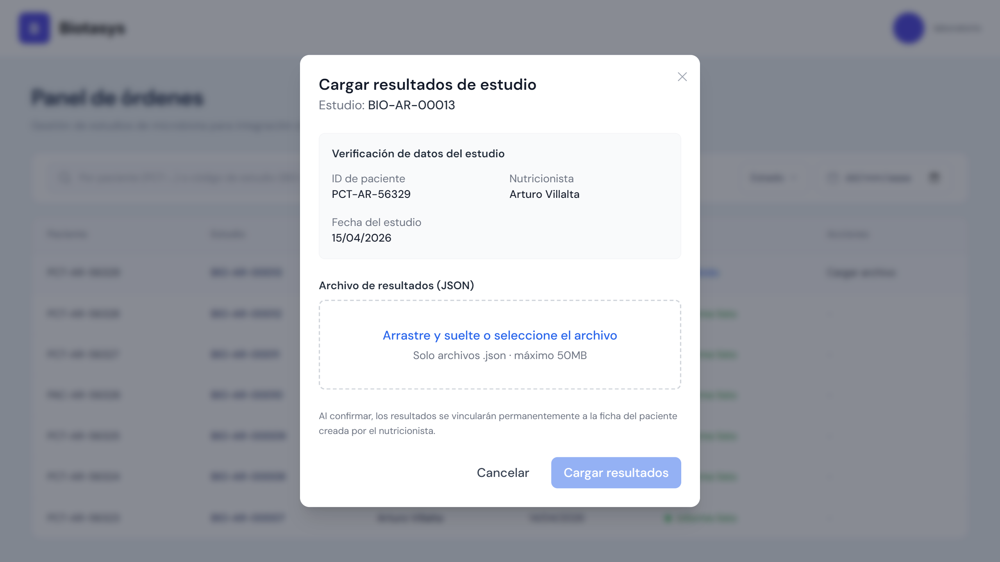
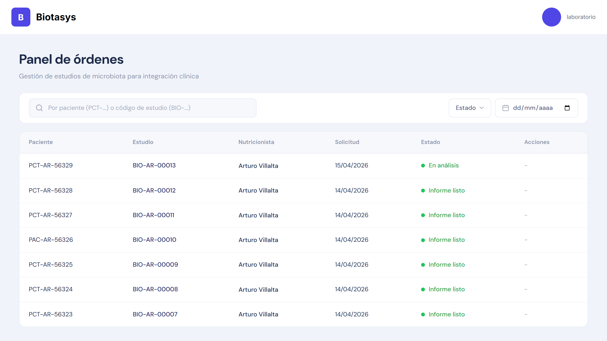
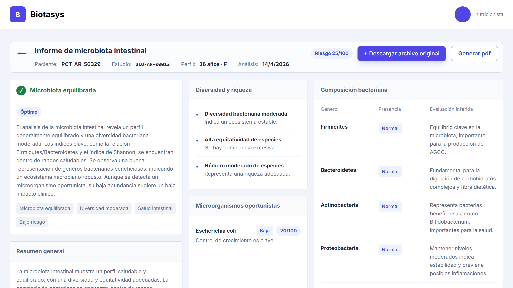
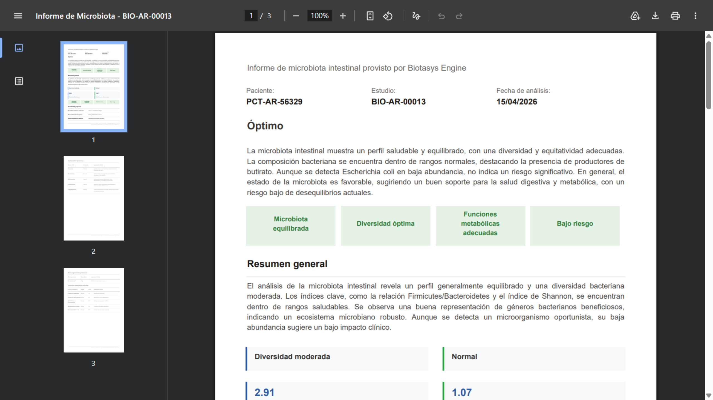

# Biotasys AI Engine 

**Biotasys AI Engine** is an AI-powered backend pipeline integrating the **Gemini 2.5 Flash API** to transform raw microbiome laboratory JSON data into structured insights that support clinical decision-making

## Index

- [Features](#features)
- [Demo](#demo)
- [Tech Stack](#tech-stack)
- [Project Structure](#project-structure)
- [Installation](#installation)
- [Environment Configuration](#environment-configuration)
- [Execution](#execution)
- [Main API Endpoints](#main-api-endpoints)

---

## Features

- Designed an AI-powered backend pipeline to transform raw laboratory JSON data into structured clinical interpretations.
- Developed a secure **FastAPI** endpoint integrating **Gemini 2.5 Flash** and validating output consistency using **Pydantic** schemas.
- Orchestrated a dual-engine AI workflow, separating heterogeneous data normalization from insight generation.
- Implemented an automated system for PDF creation and report persistence using **Jinja2**, **xhtml2pdf** and **Supabase**.

---

## Demo

This demo shows the whole **Biotasys** application behavior, integrating this repository into the main [fullstack project](https://github.com/alvillalta/i006-biotasys-fullstack).

The main repository includes the rest of the backend and frontend components.

### Preview



### Key Screens

| Login |
|------|
||

| Studies Dashboard  | Study Creation | Data Upload |
|------|-------------------|-----------|
|  |  |  |

| AI processing | Microbiota Report | PDF Generation |
|------|-------------------|-----------|
|  |  |  |

---

## Tech Stack

| Component | Technology | Version |
|-----------|-----------|---------|
| **Backend Framework** | FastAPI | ≥0.104.1 |
| **Runtime** | Python | ≥3.12 |
| **Async Server** | Uvicorn | ≥0.24.0 |
| **Data Validation** | Pydantic | ≥2.5.0 |
| **AI Integration** | google-genai | ≥1.63.0 |
| **Database** | Supabase (PostgreSQL) | Latest |
| **PDF Generation** | xhtml2pdf, Jinja2 | 0.2.17, 3.1.6 | 
| **Authentication** | PassLib + Bcrypt | ≥1.7.4 |
| **Containerization** | Docker, Docker Compose | Latest |
---

## Project Structure

```
biotasys-ai/
├── app/
│   ├── api/v1/                 # API Routes & Routers
│   │   └── clinical.py         # Clinical data processing endpoints
│   │
│   ├── core/                   # Core Application Logic
│   │   ├── exceptions.py       # Custom exception hierarchy
│   │   ├── logging.py          # Structured logging configuration
│   │   ├── security.py         # API key validation & auth
│   │   └── supabase.py         # Supabase client initialization
│   │
│   ├── config/
│   │   └── settings.py         # Pydantic settings (env-based config)
│   │
│   ├── models/
│   │   └── schemas.py          # Pydantic models for validation
│   │
│   ├── repositories/           # Data Access Layer
│   │   ├── base.py            # Abstract repository
│   │   └── report_repository.py # Clinical report persistence
│   │
│   ├── services/               # Business Logic & AI Orchestration
│   │   ├── ai_service.py      # Google Gemini integration (Dual Engine)
│   │   ├── report_service.py  # Report processing pipeline
│   │   ├── pdf_service.py     # PDF generation (Jinja2 + xhtml2pdf)
│   │   └── microbiota_normalizer.py # Data normalization utilities
│   │
│   └── templates/
│       └── pdf/
│           └── microbiota_report.html # Clinical report HTML template
│
├── main.py                    # Application entry point
├── pyproject.toml             # Project metadata & dependencies
├── docker-compose.yml         # Docker services orchestration
├── Dockerfile                 # Container image definition
├── ENV_DOCS.md               # Docker setup guide
├── ENGINE_DOCS.md            # Technical integration manual
└── env.example               # Environment variables template

```

---

## Installation

### Prerequisites

- **Python 3.12+**
- **pip** or **uv** package manager
- **Git** (for cloning the repository)

### Option 1: Using pip

```bash
# Clone the repository
git clone https://github.com/yourusername/biotasys-ai.git
cd biotasys-ai

# Create virtual environment
python -m venv .venv

# Activate virtual environment
# On Windows:
.venv\Scripts\activate
# On macOS/Linux:
source .venv/bin/activate

# Install dependencies
pip install -e .

# Install development dependencies
pip install -e ".[dev]"
```

### Option 2: Using uv

```bash
# Install uv (one-time)
powershell -ExecutionPolicy ByPass -c "irm https://astral.sh/uv/install.ps1 | iex"

# Clone and navigate
git clone https://github.com/yourusername/biotasys-ai.git
cd biotasys-ai

# Sync dependencies and create environment
uv sync

# Activate environment
.venv\Scripts\activate
```

### Option 3: Using Docker

```bash
# Build and run with Docker Compose
docker-compose up --build

# Service will be accessible at http://localhost:8000
```

---

## Environment Configuration

### 1. Create `.env` File

Copy `env.example` and customize

### 2. Configure Variables

**Required Variables:**

```env
# Gemini API Configuration
GEMINI_API_KEY=your_gemini_api_key_here
EXTRACTION_MODEL=gemini-2.5-flash-lite
MODEL_NAME=gemini-2.5-flash

# JWT Configuration
JWT_SECRET_KEY=your_jwt_secret_key_here
JWT_ALGORITHM=HS256
JWT_EXPIRE_MINUTES=30

# Backend Configuration
BACKEND_NEST_URL=your_backend_main_repository_url_here

# Supabase Configuration
SUPABASE_URL=your_supabase_url_here
SUPABASE_KEY=your_supabase_key_here

# FastAPI Configuration
APP_NAME=FastAPI AI Template
APP_VERSION=1.0.0
DEBUG=true

# API Configuration
API_HOST=0.0.0.0
API_PORT=8000

# CORS Configuration
CORS_ORIGINS=["*"]
CORS_ALLOW_CREDENTIALS=true
CORS_ALLOW_METHODS=["*"]
CORS_ALLOW_HEADERS=["*"]

# Logging Configuration
LOG_LEVEL=INFO
```

### 3. Obtain API Keys

#### Google Gemini API Key
1. Go to [Google AI Studio](https://aistudio.google.com/app/apikey)
2. Create a project and generate an API key
3. Paste into `GEMINI_API_KEY`

#### Supabase Configuration
1. Create account at [supabase.com](https://supabase.com)
2. Create new project
3. Copy `Project URL` → `SUPABASE_URL`
4. Copy `Anon/Public API Key` → `SUPABASE_KEY`

---

## Execution

### Development Server

```bash
# Start with auto-reload
python main.py

# Or with uvicorn directly
uvicorn main:app --reload --port 8000

# Or with uv
uv run uvicorn main:app --reload
```

The server will start at: **http://localhost:8000**

Access documentation at: **http://localhost:8000/docs**

### Docker Deployment

```bash
docker-compose up
docker-compose down
```

---

## Main API Endpoints

All clinical endpoints require **X-API-KEY header** authentication.

### GET `/api/v1/health`

Check system is working

### POST `/api/v1/clinical/process-report-json`

Process raw microbiota JSON data (laboratory output).

**Headers:**
```
X-API-KEY: your_api_key_here
Content-Type: application/json
```

**Request Body:**
```json
{
  "study_id": "str",
  "study_code": "str",
  "nutricionist_id": "str",
  "patient_id": "str",
  "raw_json": { "..." },
  "study_date": "str"
}
```

**Response (200 OK):**
```json
{
  "study_id": "str",
  "study_code": "str",
  "nutricionist_id": "str",
  "patient_id": "str",
  "data": { "..." },
  "interpretation": { "..." },
  "file_url": "str",
  "study_date": "datetime"
}
```

**Error Responses:**

| Status | Error | Description |
|--------|-------|-------------|
| 401 | Unauthorized | Missing or invalid X-API-KEY |
| 403 | Forbidden | API key not from certified entity |
| 422 | Validation Error | Invalid request body |
| 500 | AIError | Gemini API processing failed |

---

## Contributing

Contributions are welcome!
Please feel free to open an issue or submit a pull request.

---

## License

This project is licensed under the **MIT License**.

---

*Biotasys AI Engine*